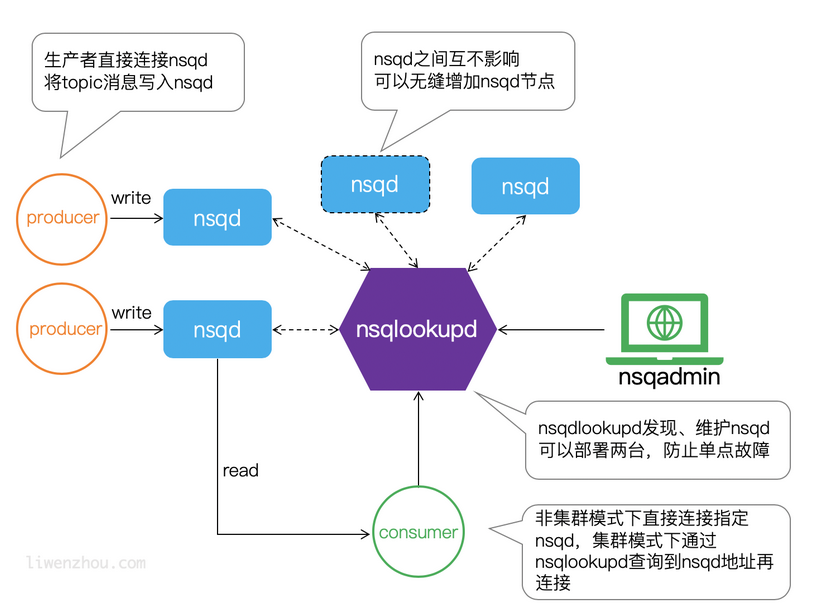

# Message Queuing(MQ)

> - 使用消息队列可以将业务流程变为并行执行，减少处理时间，提高用户体验
> - 可以将不同的业务逻辑解耦，提高可扩展性
>
> 

# NSQ

> 官方文档：[NSQ Docs 1.2.0 - Quick Start](https://nsq.io/overview/quick_start.html)
>
> NSQ是一个基于Go的分布式实时消息队列

**特点**

- 支持无限的水平扩展，分布式设计，负载均衡
- 消息传递延迟低，性能优异
- 消息存储在内存中，大小超出一定限制或重启时持久化到磁盘
- 消息不保证顺序

## Topic和Channel

一个单独的nsqd实例，可以处理多个数据流(streams)，这些数据流被称为topics

一个topic可以具有多个channels，所有的channels都会收到topic的消息的副本

一个channels可以连接多个comsumers，channels的消息会随机传递给一个可用的消费者

**topic传递给每个channel所有消息，channel传递给每个consumer一部分消息**

## 组件

### nsqd

>nsqd是接收消息、排队和向客户端传递消息的守护进程（后台进程）
>
>它可以独立运行，但通常配置在具有nsqlookupd实例的集群中
>
>它监听两个TCP端口，一个用于客户端，另一个用于HTTP API。（它可以选择在第三个端口上侦听HTTPS）
>
>客户端默认端口为4150，HTTP默认端口为4151



### nsqlookupd

> nsqlookupd是管理拓扑信息的守护进程，客户端可以通过查询nsqlookupd来查找某个topic的生产者，节点广播和channel等信息。
>
> 可以使用nsqlookup发现节点，管理集群

#### 集群配置

> 在一台机器(win)上测试

首先启动nsqlookupd进程，默认http端口为4161，tcp端口为4160

启动三个nsqd进程，设置不同的tcp和http地址，并设置lookupd-tcp的地址

```
nsqd -tcp-address="0.0.0.0:4150" -http-address="0.0.0.0:4151" -lookupd-tcp-address="127.0.0.1:4160"
```

```
nsqd -tcp-address="0.0.0.0:4250" -http-address="0.0.0.0:4251" -lookupd-tcp-address="127.0.0.1:4160"
```

```
nsqd -tcp-address="0.0.0.0:4350" -http-address="0.0.0.0:4351" -lookupd-tcp-address="127.0.0.1:4160"
```

启动nsqadmin，进入```localhost:4171```查看，显示有三个节点

### nsqadmin

> nsqadmin是一个基于web的nsq管理ui界面，可以查看集群的各项信息
>
> 使用命令``nsqadmin.exe -nsqd-http-address=127.0.0.1:4151``运行，http默认端口号为4151
>
> 访问``localhost:4171``地址进入管理页面，可以查看并管理topic和channel

## pynsq

[Writer – high-level producer — pynsq 0.7.0 documentation](https://pynsq.readthedocs.io/en/latest/writer.html)

### topic和channel

```
          
producer ├───────> topic ├───────> channel ├───────> consumer
                         │
                         |
                         ├───────> ch      ├───────> consumer1
                                           |
                                           ├───────> consumer2
```

```producer.py```

> 使用``Tornado IOLoop``每隔1000ms调用一次pub_message函数，发送后的回调函数为finish_pub，默认发送byte类型的消息

```python
import nsq
import tornado.ioloop
import time


def pub_message():
    writer.pub('topic', time.strftime('%H:%M:%S').encode(), finish_pub)


def finish_pub(conn, data):
    print(conn, data)


writer = nsq.Writer(['127.0.0.1:4150'])
tornado.ioloop.PeriodicCallback(pub_message, 1000).start()
nsq.run()
```

```consumer.py```

```python
import nsq


def handler(message):
    print(message.body)
    return True


r = nsq.Reader(message_handler=handler, nsqd_tcp_addresses=['127.0.0.1:4150'], topic='topic', channel='channel', lookupd_poll_interval=15)

nsq.run()

```

```consumer1.py```

```python
import nsq


def handler(message):
    print(message.body)
    return True


r = nsq.Reader(message_handler=handler, nsqd_tcp_addresses=['127.0.0.1:4150'], topic='topic', channel='ch', lookupd_poll_interval=15)

nsq.run()

```

```consumer2.py```

```python
import nsq


def handler(message):
    print(message.body)
    return True


r = nsq.Reader(message_handler=handler, nsqd_tcp_addresses=['127.0.0.1:4150'], topic='topic', channel='ch', lookupd_poll_interval=15)

nsq.run()

```

> 运行nsqd
>
> 首先运行三个consumer，再运行producer，查看输出

```producer```

```
127.0.0.1:4150 b'OK'
127.0.0.1:4150 b'OK'
127.0.0.1:4150 b'OK'
127.0.0.1:4150 b'OK'
127.0.0.1:4150 b'OK'
127.0.0.1:4150 b'OK'
127.0.0.1:4150 b'OK'
127.0.0.1:4150 b'OK'
127.0.0.1:4150 b'OK'
127.0.0.1:4150 b'OK'
127.0.0.1:4150 b'OK'
127.0.0.1:4150 b'OK'
127.0.0.1:4150 b'OK'
127.0.0.1:4150 b'OK'
127.0.0.1:4150 b'OK'
127.0.0.1:4150 b'OK'
127.0.0.1:4150 b'OK'
```

```consumer```

```
b'22:22:24'
b'22:22:25'
b'22:22:26'
b'22:22:27'
b'22:22:28'
b'22:22:29'
b'22:22:30'
b'22:22:31'
b'22:22:32'
b'22:22:33'
b'22:22:34'
b'22:22:35'
b'22:22:36'
b'22:22:37'
b'22:22:38'
b'22:22:39'
b'22:22:40'
```

```consumer1```

```
b'22:22:24'
b'22:22:26'
b'22:22:28'
b'22:22:30'
b'22:22:32'
b'22:22:34'
b'22:22:36'
b'22:22:38'
b'22:22:40'
```

```consumer2```

```
b'22:22:25'
b'22:22:27'
b'22:22:29'
b'22:22:31'
b'22:22:33'
b'22:22:35'
b'22:22:37'
b'22:22:39'
```

> consumer1和consumer2共用一个channel，各自收到一部分消息，channel和ch两个channel都收到全部消息

### 集群

通过指定lookupd_http地址来连接

```python
r = nsq.Reader(message_handler=handler, lookupd_http_addresses=['127.0.0.1:4161'], topic='topic', channel='channel', lookupd_poll_interval=15)
```

>lookupd_poll_interval：查询所有的nsqlookupd之间的时间(s)

