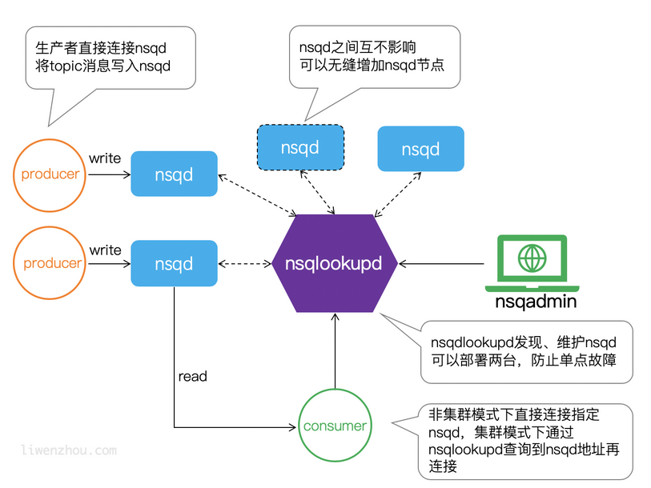

# **Message** Queue(MQ)

**消息队列**（Message queue）是一种进程间通信或同一进程的不同线程间的通信方式，用来处理一系列通常来自用户的输入，消息队列提供了异步的通信协议。

在实现上，消息队列经常保存在链表中，拥有权限的进程可以向消息队列中写入或读取消息

## 优点

- 消息队列本身是异步的，它允许接收者在消息发送很长时间后再取回消息
- 和信号相比，消息队列能够传递更多的信息。与管道相比，消息队列提供了有格式的数据，这可以减少开发人员的工作量

- 使用消息队列可以将业务流程变为并行执行，减少处理时间，提高用户体验
- 可以将不同的业务逻辑解耦，提高可扩展性
- 在高并发场景可以提供缓冲，避免过多请求使系统宕机

## 缺点

- 系统依赖变多，消息队列出故障可能会导致整个系统宕机
- 存在一致性问题，不能确保消费者成功执行

# NSQ

> 官方文档：[NSQ Docs 1.2.0 - Quick Start](https://nsq.io/overview/quick_start.html)
>
> NSQ是一个基于Go的分布式实时消息队列

**特点**

- 支持无限的水平扩展，分布式设计，负载均衡
- 消息传递延迟低，性能优异
- 消息存储在内存中，大小超出一定限制或重启时持久化到磁盘
- 消息不保证顺序

## Topic和Channel

一个单独的nsqd实例，可以处理多个数据流(streams)，这些数据流被称为topics

一个topic可以具有多个channels，所有的channels都会收到topic的消息的副本

一个channels可以连接多个comsumers，channels的消息会随机传递给一个可用的消费者

**topic传递给每个channel所有消息，channel传递给每个consumer一部分消息**

## 组件

### nsqd

>nsqd是接收消息、排队和向客户端传递消息的守护进程（后台进程）
>
>它可以独立运行，但通常配置在具有nsqlookupd实例的集群中
>
>它监听两个TCP端口，一个用于客户端，另一个用于HTTP API。（它可以选择在第三个端口上侦听HTTPS）
>
>客户端默认端口为4150，HTTP默认端口为4151



参考：https://www.liwenzhou.com/posts/Go/go_nsq/

#### 常用的命令行参数

```
-auth-http-address value
    <addr>:<port> to query auth server (may be given multiple times)
    身份验证服务器的地址
-broadcast-address string
    address that will be registered with lookupd (defaults to the OS hostname) (default "yourhost.local")
    在lookupd中注册的地址
-broadcast-http-port int
    HTTP port that will be registered with lookupd (defaults to the HTTP port that this nsqd is listening to)
    在lookupd中注册的HTTP端口号，默认是当前nsqd监听的HTTP端口号
-broadcast-tcp-port int
    TCP port that will be registered with lookupd (defaults to the TCP port that this nsqd is listening to)
    在lookupd中注册的TCP端口号，默认是当前nsqd监听的TCP端口号
-config string
    path to config file
    配置文件的路径
-data-path string
    path to store disk-backed messages
    消息持久化的文件路径
-http-address string
    <addr>:<port> to listen on for HTTP clients (default "0.0.0.0:4151")
    当前nsqd监听的HTTP地址，客户端可以发送HTTP请求
-http-client-connect-timeout duration
    timeout for HTTP connect (default 2s)
    HTTP连接超时时间
-http-client-request-timeout duration
    timeout for HTTP request (default 5s)
    HTTP请求超时时间
-https-address string
    <addr>:<port> to listen on for HTTPS clients (default "0.0.0.0:4152")
    当前nsqd监听的HTTPS地址，客户端可以发送HTTPS请求
-log-level value
    set log verbosity: debug, info, warn, error, or fatal (default INFO)
    设置日志的详细程度
-log-prefix string
    log message prefix (default "[nsqd] ")
    设置日志消息的前缀
-lookupd-tcp-address value
    lookupd TCP address (may be given multiple times)
    集群的lookupd的TCP地址
-max-body-size int
    maximum size of a single command body (default 5242880)
    单个指令主体的最大长度
-max-bytes-per-file int
    number of bytes per diskqueue file before rolling (default 104857600)
    回滚前，每个持久化的队列文件的最大字节数
-max-channel-consumers int
    maximum channel consumer connection count per nsqd instance (default 0, i.e., unlimited)
    连接到每个nsqd的消费者的最大数量
-max-msg-size int
    maximum size of a single message in bytes (default 1048576)
    单个消息的最大字节数
-max-msg-timeout duration
    maximum duration before a message will timeout (default 15m0s)
-mem-queue-size int
    number of messages to keep in memory (per topic/channel) (default 10000)
    每个channel中保存在内存中的最大消息数量
-node-id int
    unique part for message IDs, (int) in range [0,1024) (default is hash of hostname) (default 248)
    当前节点的id，用于消息id的唯一部分
-tcp-address string
    <addr>:<port> to listen on for TCP clients (default "0.0.0.0:4150")
    客户端连接的TCP地址
```


#### HTTP API

| 请求                                     | 作用                                                |
| ---------------------------------------- | --------------------------------------------------- |
| `POST` `/pub` | 发布消息 |
| `POST` `/mpub` | 一次发送多个消息 |
| `POST` `/topic/create` | 创建一个topic |
| `POST` `/channel/delete` | 从现有topic上删除一个channel |
| `POST` `/channel/empty` | 清空现有channel的所有消息（内存和磁盘中） |
| `POST` `/topic/pause` | 暂停当前所有topic的channels的消息流（消息将在主题处排队） |
| `POST` `/topic/unpause` | 将消息流恢复到已暂停的现有topic的channels |
| `POST` `/channel/pause` | 暂停到现有channel使用者的消息流（消息将在channel处排队） |
| `POST` `/channel/unpause` | 将消息流恢复到现有已暂停channel的使用者，Params中写明topic和channel |
| `GET` `/stats` | 返回统计信息，topic和channel |
| `GET` `/ping`                            | 检测节点状态，正常返回200，不正常返回500            |
| `GET` `/info`                            | 返回版本信息                                        |
| `GET` `/debug/pprof`                     | 调试页面                                            |
| `GET` `/debug/pprof/profile`             | 启动CPU配置文件30秒并返回输出                       |
| `GET` `/debug/pprof/goroutine`           | 返回所有正在运行的Go协程的堆栈跟踪                  |
| `GET` `/debug/pprof/heap`                | 返回堆和配置文件                                    |
| `GET` `/debug/pprof/block`               | 返回Go协程阻塞配置文件                              |
| `GET` `/debug/pprof/threadcreate`        | 返回创建系统线程的Go协程的堆栈跟踪                  |
| `GET` `/config/nsqlookupd_tcp_addresses` | 返回nsqlookupd管理的集群节点的TCP地址               |
| `PUT` `/config/nsqlookupd_tcp_addresses` | 更新nsqlookupd的TCP地址，消息体中使用列表表示地址。 |


### nsqlookupd

> nsqlookupd是管理拓扑信息的守护进程，客户端可以通过查询nsqlookupd来查找某个topic的生产者，节点广播和channel等信息。
>
> 可以使用nsqlookup发现节点，管理集群

#### 集群配置

> 在一台机器(win)上测试

首先启动nsqlookupd进程，默认http端口为4161，tcp端口为4160

启动三个nsqd进程，设置不同的tcp和http地址，并设置lookupd-tcp的地址

```
nsqd -tcp-address="0.0.0.0:4150" -http-address="0.0.0.0:4151" -lookupd-tcp-address="127.0.0.1:4160"
```

```
nsqd -tcp-address="0.0.0.0:4250" -http-address="0.0.0.0:4251" -lookupd-tcp-address="127.0.0.1:4160"
```

```
nsqd -tcp-address="0.0.0.0:4350" -http-address="0.0.0.0:4351" -lookupd-tcp-address="127.0.0.1:4160"
```

启动nsqadmin，进入```localhost:4171```查看，显示有三个节点

### nsqadmin

> nsqadmin是一个基于web的nsq管理ui界面，可以查看集群的各项信息
>
> 使用命令``nsqadmin.exe -nsqd-http-address=127.0.0.1:4151``运行，http默认端口号为4151
>
> 访问``localhost:4171``地址进入管理页面，可以查看并管理topic和channel

## pynsq

[Writer – high-level producer — pynsq 0.7.0 documentation](https://pynsq.readthedocs.io/en/latest/writer.html)

### topic和channel

```
          
producer ├───────> topic ├───────> channel ├───────> consumer
                         │
                         |
                         ├───────> ch      ├───────> consumer1
                                           |
                                           ├───────> consumer2
```

```producer.py```

> 使用``Tornado IOLoop``每隔1000ms调用一次pub_message函数，发送后的回调函数为finish_pub，默认发送byte类型的消息

```python
import nsq
import tornado.ioloop
import time


def pub_message():
    writer.pub('topic', time.strftime('%H:%M:%S').encode(), finish_pub)


def finish_pub(conn, data):
    print(conn, data)


writer = nsq.Writer(['127.0.0.1:4150'])
tornado.ioloop.PeriodicCallback(pub_message, 1000).start()
nsq.run()
```

```consumer.py```

```python
import nsq


def handler(message):
    print(message.body)
    return True


r = nsq.Reader(message_handler=handler, nsqd_tcp_addresses=['127.0.0.1:4150'], topic='topic', channel='channel', lookupd_poll_interval=15)

nsq.run()

```

```consumer1.py```

```python
import nsq


def handler(message):
    print(message.body)
    return True


r = nsq.Reader(message_handler=handler, nsqd_tcp_addresses=['127.0.0.1:4150'], topic='topic', channel='ch', lookupd_poll_interval=15)

nsq.run()

```

```consumer2.py```

```python
import nsq


def handler(message):
    print(message.body)
    return True


r = nsq.Reader(message_handler=handler, nsqd_tcp_addresses=['127.0.0.1:4150'], topic='topic', channel='ch', lookupd_poll_interval=15)

nsq.run()

```

> 运行nsqd
>
> 首先运行三个consumer，再运行producer，查看输出

```producer```

```
127.0.0.1:4150 b'OK'
127.0.0.1:4150 b'OK'
127.0.0.1:4150 b'OK'
127.0.0.1:4150 b'OK'
127.0.0.1:4150 b'OK'
127.0.0.1:4150 b'OK'
127.0.0.1:4150 b'OK'
127.0.0.1:4150 b'OK'
127.0.0.1:4150 b'OK'
127.0.0.1:4150 b'OK'
127.0.0.1:4150 b'OK'
127.0.0.1:4150 b'OK'
127.0.0.1:4150 b'OK'
127.0.0.1:4150 b'OK'
127.0.0.1:4150 b'OK'
127.0.0.1:4150 b'OK'
127.0.0.1:4150 b'OK'
```

```consumer```

```
b'22:22:24'
b'22:22:25'
b'22:22:26'
b'22:22:27'
b'22:22:28'
b'22:22:29'
b'22:22:30'
b'22:22:31'
b'22:22:32'
b'22:22:33'
b'22:22:34'
b'22:22:35'
b'22:22:36'
b'22:22:37'
b'22:22:38'
b'22:22:39'
b'22:22:40'
```

```consumer1```

```
b'22:22:24'
b'22:22:26'
b'22:22:28'
b'22:22:30'
b'22:22:32'
b'22:22:34'
b'22:22:36'
b'22:22:38'
b'22:22:40'
```

```consumer2```

```
b'22:22:25'
b'22:22:27'
b'22:22:29'
b'22:22:31'
b'22:22:33'
b'22:22:35'
b'22:22:37'
b'22:22:39'
```

> consumer1和consumer2共用一个channel，各自收到一部分消息，channel和ch两个channel都收到全部消息

### 集群

通过指定lookupd_http地址来连接

```python
r = nsq.Reader(message_handler=handler, lookupd_http_addresses=['127.0.0.1:4161'], topic='topic', channel='channel', lookupd_poll_interval=15)
```

>lookupd_poll_interval：查询所有的nsqlookupd之间的时间(s)

# 消息队列

| 特性                    | ActiveMQ                                                     | RabbitMQ                                                     | RocketMQ                                                     | Kafka                                                        | NSQ                                            |
| ----------------------- | ------------------------------------------------------------ | ------------------------------------------------------------ | ------------------------------------------------------------ | ------------------------------------------------------------ | ---------------------------------------------- |
| 单机吞吐量              | 万级，吞吐量比RocketMQ和Kafka要低了一个数量级                | 万级，吞吐量比RocketMQ和Kafka要低了一个数量级                | 10万级，RocketMQ也是可以支撑高吞吐的一种MQ                   | 10万级别，这是kafka最大的优点，就是吞吐量高。  一般配合大数据类的系统来进行实时数据计算、日志采集等场景 | 100万级                                        |
| topic数量对吞吐量的影响 |                                                              |                                                              | topic可以达到几百，几千个的级别，吞吐量会有较小幅度的下降  这是RocketMQ的一大优势，在同等机器下，可以支撑大量的topic | topic从几十个到几百个的时候，吞吐量会大幅度下降  所以在同等机器下，kafka尽量保证topic数量不要过多。如果要支撑大规模topic，需要增加更多的机器资源 | topic数量到达一千左右时性能会有较大下降        |
| 时效性                  | ms级                                                         | 微秒级，这是rabbitmq的一大特点，延迟是最低的                 | ms级                                                         | 延迟在ms级以内                                               |                                                |
| 可用性                  | 高，基于主从架构实现高可用性                                 | 高，基于主从架构实现高可用性                                 | 非常高，分布式架构                                           | 非常高，kafka是分布式的，一个数据多个副本，少数机器宕机，不会丢失数据，不会导致不可用 | 非常高，分布式架构                             |
| 消息可靠性              | 有较低的概率丢失数据                                         |                                                              | 经过参数优化配置，可以做到0丢失                              | 经过参数优化配置，消息可以做到0丢失                          | 当消息到达一定数量会持久化到磁盘，可以手动配置 |
| 功能支持                | MQ领域的功能极其完备                                         | 基于erlang开发，所以并发能力很强，性能极其好，延时很低       | MQ功能较为完善，还是分布式的，扩展性好                       | 功能较为简单，主要支持简单的MQ功能，在大数据领域的实时计算以及日志采集被大规模使用，是事实上的标准 | 功能简单，易于使用                             |
| 优劣势总结              | 非常成熟，功能强大，在业内大量的公司以及项目中都有应用  偶尔会有较低概率丢失消息  而且现在社区以及国内应用都越来越少，官方社区现在对ActiveMQ 5.x维护越来越少，几个月才发布一个版本  而且确实主要是基于解耦和异步来用的，较少在大规模吞吐的场景中使用 | erlang语言开发，性能极其好，延时很低；  吞吐量到万级，MQ功能比较完备  而且开源提供的管理界面非常棒，用起来很好用  社区相对比较活跃，几乎每个月都发布几个版本分  在国内一些互联网公司近几年用rabbitmq也比较多一些  但是问题也是显而易见的，RabbitMQ确实吞吐量会低一些，这是因为他做的实现机制比较重。  而且erlang开发，国内有几个公司有实力做erlang源码级别的研究和定制？如果说你没这个实力的话，确实偶尔会有一些问题，你很难去看懂源码，你公司对这个东西的掌控很弱，基本职能依赖于开源社区的快速维护和修复bug。  而且rabbitmq集群动态扩展会很麻烦，不过这个我觉得还好。其实主要是erlang语言本身带来的问题。很难读源码，很难定制和掌控。 | 接口简单易用，而且毕竟在阿里大规模应用过，有阿里品牌保障  日处理消息上百亿之多，可以做到大规模吞吐，性能也非常好，分布式扩展也很方便，社区维护还可以，可靠性和可用性都是ok的，还可以支撑大规模的topic数量，支持复杂MQ业务场景  而且一个很大的优势在于，阿里出品都是java系的，我们可以自己阅读源码，定制自己公司的MQ，可以掌控  社区活跃度相对较为一般，不过也还可以，文档相对来说简单一些，然后接口这块不是按照标准JMS规范走的有些系统要迁移需要修改大量代码  还有就是阿里出台的技术，你得做好这个技术万一被抛弃，社区黄掉的风险，那如果你们公司有技术实力我觉得用RocketMQ挺好的 | kafka的特点其实很明显，就是仅仅提供较少的核心功能，但是提供超高的吞吐量，ms级的延迟，极高的可用性以及可靠性，而且分布式可以任意扩展  同时kafka最好是支撑较少的topic数量即可，保证其超高吞吐量  而且kafka唯一的一点劣势是有可能消息重复消费，那么对数据准确性会造成极其轻微的影响，在大数据领域中以及日志采集中，这点轻微影响可以忽略  这个特性天然适合大数据实时计算以及日志收集 |                                                |

参考 https://www.cnblogs.com/laojiao/p/9573016.html

- 一般业务系统要使用MQ，RocketMQ是很好的选择

- 对于大数据领域的实时计算、日志采集能需求，Kafka是处于业界标准地位的，使用Kafka更为合适。
- NSQ使用Go语言实现，适合小型项目，自带分布式集群配置工具

