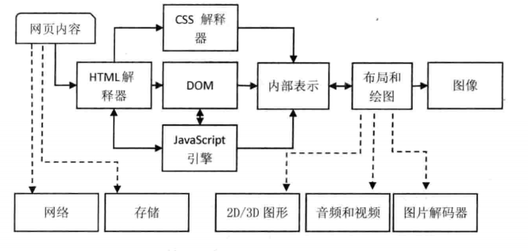
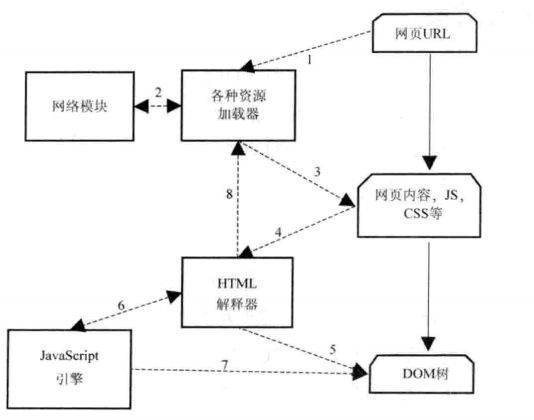

# 基础

## 目录

+ 浏览器架构
+ HTML5和CSS3能力
+ DOM接口


## 浏览器架构

### 浏览器简介

大体上来讲，浏览器的重要功能包括一下几个部分：

+ 网络：浏览器通过网络来下载各种各样的资源，例如HTML文本、JavaScript代码、样式表、图片、音视频文件等。网络部分其实非常重要，因为它耗时比较长而且需要安全访问互联网上的资源。
+ 资源管理： 从网络下载或者本地获取资源，并将他们管理起来，这需要高效的管理机制。例如如何避免重复下载资源、缓存资源等，都是它们需要解决的问题。
+ 网页浏览：这是浏览器的核心也是最基本、最重要的功能，它通过网络下载资源并从资源管理器获得资源，将他们转变为可视化的结果。
+ 多页面管理：很多浏览器支持多页面浏览，所以需要支持多个网页同时加载，这让浏览器变得更为复杂。同时，如何解决多页面的相互影响和安全等问题也非常重要，为此，一些浏览器做了大量的工作，例如可能使用线程或是进程来绘制网页。
+ 插件和扩展：这是现代浏览器的一个重要特征，它们不仅能现实网页，而且能支持各种形式的插件和扩展。插件是用来现实网页特定内容的，而扩展则是增加浏览器新功能的软件或压缩包。目前常见的插件有NPAPI插件、PPAPI插件、ActiveX插件等，扩展则跟浏览器密切相关，常见的有Firefox扩展和Chromium扩展。
+ 账户和同步：将浏览的相关信息，例如历史记录、书签等信息同步到服务器，给用户一个多系统下的统一体验，这对用户非常友好，是浏览器易用性的一个显著标识。
+ 安全机制：本质是提供一个安全的浏览器环境，避免用户信息被各种非法工具窃取和破坏。这可能包括显示用户访问的网站是否安全、为网站设置安全级别、防止浏览器被恶意代码攻破等。
+ 开发者工具： 一个优秀的开发者工具可以帮助审查HTML元素、调试JavaScript代码、改善网页性能等。

### 浏览器内核及特性

浏览器中最重要的模块就是浏览器内核，它主要的作用是将页面转变成可视化的图像结果。它也被称为**排版引擎**,浏览器的渲染引擎就是能够将HTML/CSS/JavaScript文本及其相应的资源文件转换成图像结果的模块。


目前，主流的渲染引擎包括Trident、Gecko、Webkit，它们分别是IE、Firefox和chrome的内核（2013年，Google宣布了Blink内核，它其实是从Webkit复制出去的）。

|  -                           | Trident | Gecko | Webkit |
| ---                          |  ----    | ----- | ----   |
| 基于渲染引擎的浏览器或者Web平台| IE       | Firefox| Safari， Chromium/Chrome, Android浏览器, ChromeOS, WebOS等 | 

由苹果发起的Webkit开源项目最受业界关注。自从开放源代码后，越来越多的浏览器采用该渲染引擎，特别是在移动领域，更占据了垄断的地位。


一个渲染引擎主要包括HTML解释器、CSS解释器、布局和JavaScript引擎等，其他还有绘图模块、王洛平等并没有在图中直接表示出来，下面依次来描述它们。

+ HTML解释器：解释HTML文本的解释器，主要作用是将HTML文本解释成DOM（文档对象模型）树，DOM是一种文档的表示方法。
+ CSS解释器：级联样式表的解释器，它的作用是为DOM中的各个元素对象计算出央视信息，从而为计算最后网页的布局提供基础设施。
+ 布局：在DOM创建之后，Webkit需要将其中的元素对象同样式信息结合起来，计算他们的大小位置等布局信息，形成一个能够表示这所有信息的内部表示模型。
+ JavaScript引擎：使用JavaScript代码可以修改网页的内容，也能修改CSS的信息，JavaScript引擎能够解释JavaScript代码并通过DOM接口和CSSOM接口来修改网页内容和样式信息，从而改变渲染的结果。
+ 绘图：使用图形库将布局计算后的各个网页的节点绘制成图像结果。



从左至右逐次解释上图过程，先后关系由图中的实线箭头表示。从左上角开始，首先是网页内容，输入到HTML解释器，HTML解释器在解释它后构建成一颗DOM树，这期间如果遇到JavaScript代码则交给JavaScript引擎去处理；如果网页中包含CSS，则交给CSS解释器去解释。当DOM建立的时候，渲染引擎接受来自CSS解释器的样式信息，构建一个新的内部绘图模型。该模型由布局模块计算模型内部各个元素的位置和大小信息，最后由绘图模块完成从该模型到图像的绘制。

图中的虚线箭头表示，在渲染过充中，每个阶段可能使用到的其他模块。在网页内容的下载中，需要使用到网络和存储。在计算布局和绘图时，需要使用2D/3D的图形模块，同时因为要生成最后的可视化结果，这时需要开始解码音频、视频和图片，同其他内容一起绘制到最后的图像中。


### Webkit内核


webkit的一个显著特征就是它支持不同的浏览器，因为不同浏览器的需求不同，所以在Webkit中，一些代码可以共享，但是另外一部分时不同的，这些不同的部分称为Webkit的移植（Ports）。

图中的Webkit架构，虚线框表示该部分模块在不同浏览器使用的Webkit内核中的实现时不一样的，也就是它们不是普遍共享的。用实线框标记的模块表示它们基本上时共享的，或者说它们中的一些特性可能并不是共享的，而且可以通过不同的编译配置改变它们的行为。所以，很多使用Webkit的浏览器可能会表现出不同的行为。

依次向上来分析，图中最下面的时“操作系统”， Webkit可以在不同的操作系统上工作（具体选择视不同的需要而定）。不同浏览器可能会依赖不同的操作系统，同一个浏览器使用的WebKit也可能依赖不同的操作系统，例如，Chromium浏览器支持Windows、Mac OS、Linux、Android等系统。

在“操作系统”层之上的就是Webkit赖以工作的众多第三方库，这些库时WebKit运行的基础。通常来讲，它们包括图形库、网络库、视频库等，加载和渲染网页需要它们不足为奇。WebKit时这些库的使用者，如何高效地使用它们是WebKit和各种浏览器厂商的一个重大课题，主要是如何设计良好的架构来利用它们以获得高性能。现在浏览器的功能越来越强，性能要求也越来越高，新的技术不断被引入浏览器和Web平台，这也大大增加了WebKit和浏览器的复杂性。

在它们二者之上的就是WebKit项目了，WebCore部分包含了目前被各个浏览器所使用的WebKit共享部分，这些都是加载和渲染网页的基础部分，它们必不可少，具体包括HTML解释器、CSS解释器、SVG、DOM、渲染树，以及Inspector（调试网页）。这些共享部分有些是基础框架，其背后的支持也需要各个平台的不同实现。举个例子，“剪贴板”这个功能其实跟平台密切相关，在Webkit的gtk版本中，它就要依赖于gtk的一个具体实现。

JavaScriptCore引擎是WebKit中的默认JavaScript引擎，也就是说一些WebKit的移植使用该引擎，刚开始，它的性能不是很好，但是随着越来越多的优化被加入，现在的性能已变得非常不错。

WebKit Ports指的是Webkit中的非共享部分，对于不同浏览器使用的WebKit来说，移植中的这些模块由于平台差异、依赖的第三方库和需求不同等方面原因，往往按照自己的方式来设计和实现，这就产生了移植部分，这就是导致众多Webkit版本的行为并非一致的重要原因。这其中包括硬件加速架构、网络栈、视频解码、图片解码等。后面我们用移植表示一个不同的实现，例如Qt移植表示的是WebKit的Qt版，被Qt项目所使用。这一部分非常重要，对性能和功能影响非常大。

在WebCore和Wokit Ports之上的层主要是提供嵌入式编程接口，这些嵌入式接口时提供给浏览器调用的。图中有左右两个部分分别时狭义WebKit的接口和WebKit2的接口。

WebKit还有一个部分在图中没有展现出来，就是测试用例，包括布局测试用例（Layout Tests）和性能测试用例（Performance Tests），这两类测试包含了大量的测试用例和期望结果。虽然，不同的WebKit移植对应的测试用例不一样，总体上来讲WebKit移植还是共享了大量的用例。为了保证WebKit的代码质量，这些用例被用来验证渲染结果的正确性。每个浏览器所用的Webkit必须保证能够编译出来一个可执行程序，称为DumpRenderTree，它被用来运行测试用例并将渲染结果同期望结果对比。


## HTML网页和结构

### 网页构成

简单来讲，HTML网页就是一种使用HTML语言撰写的文档。但是，现在的网页基本上都是动态网页（Dynamic HTML），也就是网页可以出现动画，可以与用户交互，这就需要CSS样式语言和JavaScript语言。在这样的动态网页中，JavaScript代码用来控制网页内部的逻辑，CSS用来描述网页的显示信息。接下来是一个例子

```html
<html>   <!-- HTML文本 -->
<head>
    <style type="text/css">    <!-- CSS代码 -->
    img {width: 100px;}
    </style>
    <title>This is a simple case.</title>
</head>
<body>
    </img>  <!-- 图片资源 -->
    <div> Hello World! </div>
    <script type="text/javascript">
        window.onload = function (){
            console.log("window.onload()");
        }
        consoloe.log("It's me.");
    </script>
</body>

```

整个网页可以看成一种树状结构，其树根是"html", 这是网页的根元素（或称节点）。根下面也包含两个子节点“head"和“body”。“head”的child “style”包含的就是一顿css代码，用来定义元素的样式信息。

CSS是一种样式表语言，用来描述元素的显示信息。在HTML的早期，内容和显示是混在一起的，最典型的例子莫过于使用table元素来展示数据。这对网页的代码结构非常不利。因为，如果Web开发者想修改数据的显示方式，也要修改数据本身，会很麻烦。有鉴于此，借鉴数据和显示分离的原理，规范设计者可以将有关显示的信息例如颜色、大小、字体等抽取出来，使用CSS语言编写代码来描述它们，与HTML元素的内容分离开来。

“body”节点下面包含三个子节点，其一是“img”节点，用来在网页中显示图片资源；其二是“div”节点；其三是“script”节点，它包括一段JavaScript代码。

JavaScript是一种解释型的脚本语言，主要目的是控制用户端逻辑、同用户交互等，它可以修改HTML元素及其内容。

由上面的分析可以看出，一个完整的网页组成包括HTML文本、JavaScript代码、CSS代码以及各种各样的资源文件。网络上的每个资源都是由URL(Unified Resource Locator)标记的，它是URI(Unified Resource Identifier)的一种实现。这表明对于浏览器来讲，区分两个资源是否相同的唯一标准就是它们的URL是否一致。


### WebKit的网页渲染过程

网页渲染有一个特性，那就是网页通常比我们的屏幕可视面积要大（在移动设备上尤其明显），而当前可见的区域，我们称为视图（viewport）。

根据数据的流向，这里将渲染过程分成三个阶段，第一个阶段是从网页的URL到构建玩DOM树，第二个阶段是从DOM树到构建玩WebKit的绘图上下文，第三个阶段是从绘图上下文到生成最终的图像。



上图描述的是从网页URL到构建完DOM树这个过程，数字表示的是基本顺序。

具体过程如下:

1. 当用户输入网页URL的时候，WebKit调用其资源加载器加载该URL对应的网页。
2. 加载器依赖网络模块建立连接，发送请求并接受答复。
3. WebKit接收到各种网页或者资源的数据，其中某些资源可能是同步或异步获取的。
4. 网页被交给HTML解释器转变成一系列的词语(Token)。
5. 解释器根据词语构建节点（Node）,形成DOM树。
6. 如果节点是JavaScript代码的话，调用JavaScript引擎解释并执行。
7. JavaScript代码可能会修改DOM树的结构。
8. 如果节点需要依赖其他资源，例如图片、CSS、视频等，调用资源加载器来加载来加载它们，但是它们是异步的，不会阻碍当前DOM树的继续创建；如果是JavaScript资源URL(没有标记异步方式)，则需要停止当前DOM树的创建，直到JavaScript的资源加载并被JavaScript引擎执行后才继续DOM树的创建。

在上述的过程中，网页在加载和渲染过程中会发出“DOMContent”事件和DOM的“onload”事件，分别在DOM树构建完之后，以及DOM树建完并且网页所依赖的资源都加载完之后发生，因为某些资源的加载并不会阻碍DOM树的创建，所以这两个事件多数时候不是同时发生的。


接下来就是WebKit利用CSS和DOM树构建RenderObject树直到绘图上下文。这一过程具体如下：

1. CSS文件被CSS解释器解释成内部表示结构。
2. CSS解释器工作完之后，在DOM树上附加解释后的样式信息，这就是RenderObject树。
3. Render节点在创建的同时，WebKit会根据网页的层次结构创建RenderLayer树，同时构建一个虚拟的绘图上下文。

最后就是根据绘图上下文来生成最终的图像，这一过程主要依赖2D和3D图形库。


这一阶段对应的具体过程如下：

1. 绘图上下文是一个与平台无关的抽象类，它将每个绘图操作桥接到不同的具体实现类，也就是绘图具体实现类。
2. 绘图实现类的实现可复杂，可简单。在Chromium中，它的实现相当复杂，需要Chromium的合成器来完成复杂的多进程和GPU加速机制。
3. 绘图实现类将2D图形库或者3D图形库绘制的结果保存下来，交给浏览器来同浏览器界面一起显示。

这一过程实际上可能不像图中描述的那么简单，现代浏览器为了绘图上的高效性和安全性，可能会在这一过程中引入复杂的机制。而且，绘图也从之前单纯的软件渲染，到现在的GPU硬件渲染、混合渲染模型等方式。

## DOM的事件机制

事件在工作过程中使用两个主体，第一个是事件（event），第二个是事件目标(eventTarget)。WebKit中用EventTarget类来表示DOM规范中Events部分定义的事件目标。

每个事件都有属性来标记该事件的事件目标。当事件达到事件目标（如一个元素节点）的时候，在这个目标上注册的监听者（Event Listeners）都会被触发调用，当然这些监听者的调用顺序是不固定的，所以不能依赖监听者注册的顺序来决定你的代码逻辑。


图中的接口是用来注册和移除监听者的。

事件处理最重要的部分就是事件捕获和事件冒泡这两种机制。当渲染引擎接收到一个事件的时候，它会通过HitTest(WebKit中的一种检查触发事件在哪个区域的算法)检查哪个元素是直接的事件目标。在图中，以“img”为例，假设它是事件的直接目标，这样，事件会经过自定向下和自底向上两个过程。

事件的捕获是自顶向下的，这也就是说，事件显示到document节点，然后一路到达目标节点。在图中，顺序就是 “#document”->"HTML"-> "body" -> "img"这样一个顺序。事件可以在这一传递过程中被捕获，只需要在注册监听者的时候设置相应的参数即可。默认情况下，其他节点不捕获这样的事件。如果网页注册了这样的监听者，那么监听者的回调函数会被调用，函数可以通过事件的“stopPropagation”函数来组织事件向下传递。

事件的冒泡过程是从下向上的顺序，它的默认行为是不冒泡，但是事件包含一个是否冒泡的属性。当这一属性为真的时候，渲染引擎会将该事件首先传递给事件目标节点的父亲，然后是父亲的父亲，以此类推。同捕获动作一样，这些监听函数也可以使用“stopPropagation”函数来阻止事件向上传递。

## CSS3能力


CSS语言主要定义了一系列作用在各个元素上的样式规则，包括:

+ 选择器
+ 样式
+ 变形、变换和动画

 ### 样式规则
 样式规则是CSS规范中最基本的组成，通常，CSS文档包含一系列的样式规则。

 

 上图描述了一个典型的CSS规则结构。一个规则包括两个部分——规则头和规则体。规则头由一个或者多个选择器组成，选择器随后会被介绍；规则提则由一个或者多个样式声明组成，每个样式声明由样式名和样式值构成，表示这个规则对哪些样式进行了规定和设置。

 当HTML中的某个元素经过后面的匹配算法使用了这条规则，那么就将这些样式设置为该元素的样式，除非有更高优先级的规则匹配上该元素。

 ### 选择器

 CSS的选择器是一组模式，用来匹配相应的HTML元素。当选择器匹配相应元素的时候，该选择器所包含的各种样式值就会作用域匹配的元素上。通过选择器，CSS能够精准地控制HTML页面中的任意一个或者多个元素的样式属性。

 一些主要的选择器：

 + 标签选择器： 根据标签元素的名称来匹配，可以选择一个或者多个元素。
 + 类型选择器： 根据类型信息来选择目标元素，类型选择器可以选择一个或者多个元素。如“.aclass”
 + ID选择器：  根据元素的ID来选择目标元素，一个选择器仅能选择一个元素。如“#adiv”
 + 属性选择器：更具属性来选择目标元素，可以选择一个或者多个，如“div[id='adiv']”
 + 后代选择器：选择某元素包含的后代元素，可以选择一个或者多个，如“body div”


一般而言，选择器描述得月具体，它的优先级越高，也就是说选择器指向的月准确，它的优先级就越高。例如，如果用1表示标签选择器的优先级，那么类选择器优先级是10，ID选择器就是100，数值越大表示优先级越高。所以，尽量使用控制精确的选择器，使用优先级合理的选择器。假如对于元素的某一样式属性，两个匹配上的选择器都设置了该属性值，那么再次情况下，优先级高的选择器所设置的属性值将会应用到该元素上。

### 框模型


框模型（Box model，或称箱子模型）是CSS标准中引入来表示HTML标签元素的布局结构。一个框模型大致包括了四个部分，它们从外到内分别是外边距(Margin)、边框(Border)、内边距(padding)和内容（Content）。在HTML网页中，每个可视元素（之所以强调可视是因为很多HTML元素其实不是用来显示的）的布局都是按照框模型来设计的。网页通过对元素设置这些样式属性，就可以达到特定的布局效果。

框模型中的最边缘部分分别是四个方向上的外边距，可以为这四个外边距设置不同的大小，图中特意将这些方向上的外边距绘制得不一样，也是表明了这个含义。图中外边距往内是四个方向上的边框，再次是四个方向上的内边距，最后是该元素显示自己的内容所使用的区域。


### 包含块（Containing Block）模型

当WebKit计算元素的箱子的位置和大小时，WebKit需要计算该元素和另外一个矩形区域的相对位置，这个矩形区域称为该元素的包含块。上面介绍的框模型就是在包含块内计算和确定各个元素的，包含块的具体定义如下。

+ 根元素的包含块称为初始包含块，通常它的大小就是可视区域(Viewport)的大小。
+ 对于其他位置属性设置为“static”或者“relative”的元素，它的包含块就是最近祖先的箱子模型中的内容区域(Content)
+ 如果元素的位置属性为“fixed”，那么该元素的包含块脱离HTML文档，固定在可视区域的某个特定位置。
+ 如果元素的位置属性为“absolute”，那么该元素的包含块由最近的含有属性“absolute”、“relative”或者“fixed”的祖先决定，具体规则如下：如果一个元素具有“inline”属性，那么元素的包含块时包含该祖先的第一个和最后一个inline框的内边距的区域；否则，包含块则是该祖先的内边距所包围的区域。


